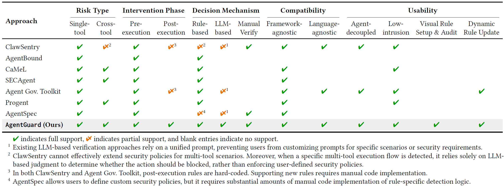

# 🛡️ AgentGuard

<p align="center">
  <a href="https://whitzardagent.github.io/AgentGuard/">
    
  </a>
  <a href="https://github.com/WhitzardAgent/AgentGuard/releases">
    
  </a>
  <a href="./LICENSE">
    
  </a>
</p>

<p align="center">
  <strong>English</strong> |
  <a href="./README_CN.md">简体中文</a>
</p>

<p align="center">
  <strong>AgentGuard: An Attribute-Based Access Control Framework for Tool-Use LLM-Based Agent</strong>
</p>

<p align="center">
  Declarative policy enforcement, provenance-aware decisions, and human-in-the-loop safety for tool invocations.
</p>

<table align="center" width="100%" cellspacing="0" cellpadding="0">
  <tr>
    <td align="center" width="30%" style="padding: 20px 18px; border: 1px solid #e5e7eb; border-radius: 18px; background: #ffffff;">
      <div style="font-size: 28px; line-height: 1; margin-bottom: 10px;">🧩</div>
      <small><strong>Seamless&nbsp;Integration</strong></small>
    </td>
    <td align="center" width="30%" style="padding: 20px 18px; border: 1px solid #e5e7eb; border-radius: 18px; background: #ffffff;">
      <div style="font-size: 28px; line-height: 1; margin-bottom: 10px;">🛡️</div>
      <small><strong>Multi&#8209;Risk&nbsp;Coverage</strong></small>
    </td>
    <td align="center" width="40%" style="padding: 20px 18px; border: 1px solid #e5e7eb; border-radius: 18px; background: #ffffff;">
      <div style="font-size: 28px; line-height: 1; margin-bottom: 10px;">👁️</div>
      <small><strong>Visual&nbsp;Rule&nbsp;Setup&nbsp;&amp;&nbsp;Audit</strong></small>
    </td>
  </tr>
</table>


> [!IMPORTANT]
> This project is still under active development and may contain bugs. Contributions via Issues and PRs are welcome.

AgentGuard is an attribute-based access control framework for agent tool calls that sits between an LLM-based planning engine and the tools it invokes. Before each tool call is executed, and again after it completes, AgentGuard evaluates the agent's behavior against declarative policies to decide whether the action should proceed as-is, be blocked, or be routed for human check.


AgentGuard can be integrated into existing agent frameworks without modifying the underlying execution logic. Currently, it supports LangChain, AutoGen, and OpenAI Agents SDK, and we are continuously expanding support for additional agent ecosystems and frameworks.

## ✨ Features

### 1. Rich Policy Expressiveness

AgentGuard policies are not hard-coded risk checks buried in business logic. They are written in a standalone DSL that describes when an action should be allowed, denied, or sent for human check. A policy can reference the principal's identity, tool metadata, tool arguments, target addresses, session history, and call-chain context, making it well-suited for the security boundaries commonly found in agent tool calls.

#### Arithmetic & Logical Expressions

Policy conditions support numeric comparisons, set membership checks, regex matching, substring matching, and arbitrary `AND` / `OR` / `NOT` combinations. For instance, `principal.trust_level < 2` distinguishes low-trust agents, `tool.recipient_domain NOT IN allowlist.email` restricts outbound destinations, and `tool.cmd MATCHES ...` identifies dangerous commands. These expressions can also be freely composed with `AND` / `OR` / `NOT`.

#### Cross-Tool Policies

AgentGuard can evaluate both individual tool calls and cross-step attack chains. Using `TRACE` and session-history functions, policies can express behaviors such as "read from a database, then send email," "read a sensitive file, then upload it to an external HTTP endpoint," or "external input eventually flows into a shell command", rather than relying solely on the current tool's arguments.

#### Multi-Phase Intervention

Policies can apply at the pre-execution `requested` phase, the post-execution `completed` phase, or the failure `failed` phase. Pre-execution is suitable for blocking or requiring approval; post-execution can be used for logging results or triggering follow-up audits and rule evaluations based on `tool.result`.

#### Diverse Policy Decisions

When a rule matches, it can return `ALLOW`, `DENY`, `HUMAN_CHECK`, or `LLM_CHECK`. Policies are therefore not limited to a binary allow/deny outcome: clearly dangerous operations can be rejected outright, while uncertain ones can be routed to a human or an LLM for review.

#### Subject & Object Labels

Policies can enforce differentiated controls based on agent (subject) and tool (object) attributes. Agents declare identity information such as `agent_id`, `session_id`, `role`, `trust_level`, and `scope`. Tools declare static labels such as `boundary`, `sensitivity`, `integrity`, and `tags`. This enables rules such as "low-trust agents cannot invoke privileged-boundary tools" or "results from high-sensitivity tools must not flow to external boundaries." Users can also define custom labels as needed.

### 2. Seamless Integration with Agent Frameworks

AgentGuard sits between the LLM-based planning engine and tools, and does not interfere with agent planning, reasoning, or task orchestration. Adapters are provided for several mainstream agent frameworks, allowing users to integrate AgentGuard with minimal code and without modifying framework internals or heavily refactoring existing agents. For frameworks not yet supported, AgentGuard offers a straightforward development interface for building custom adapters.

Currently, we support the following agent frameworks:
- [LangChain](https://github.com/langchain-ai/langchain)
- [AutoGen](https://github.com/microsoft/autogen)
- [OpenAI Agents SDK](https://github.com/openai/openai-agents-python)

### 3. Visual Policy Configuration & Audit

AgentGuard ships with a web console for managing agents. The visual interface lets users configure policies interactively without hand-writing DSL code. The policy editor relies heavily on dropdowns and other selection-based controls to reduce the policy configuration burden.

The runtime dashboard displays agent health, recent traffic, pending approval requests, and audit records. For any tool call that triggers a policy, users can inspect the matched rules, risk scores, final decisions, and the raw event/decision JSON, making it easy to understand why a particular call was denied or escalated for review.

### 4. Cluster Management

AgentGuard uses a centralized control-plane architecture to govern distributed agent processes. Agents can be deployed across multiple nodes in the network, while policy configuration and runtime monitoring are managed centrally through the control server. This architecture is particularly well-suited for organizations that need unified management across a large fleet of agents.

## 🚀 Quick Start

### 1. Write Access Control Policies and Start the Control Server

> Docker must be installed first.

Choose a host to serve as the control server, then clone AgentGuard:

```bash
git clone https://github.com/WhitzardAgent/AgentGuard.git
cd AgentGuard
```

Create an access control policy:

```bash
mkdir -p rules

cat <<EOF > rules/block_email_send.rules
RULE: block_untrusted_email_send
TRACE: Retriever -> ...? -> Mailer
CONDITION: Retriever.name == "retrieve_doc"
           AND Mailer.name == "send_email_to"
           AND Retriever.id == 0
           AND Mailer.addr != "admin@example.com"
           AND principal.trust_level < 2
POLICY: DENY
Severity: high
Category: data_exfiltration
Reason: "Low-trust principal cannot send document 0 to non-admin recipients"
EOF
```

This policy involves two agent tools: `retrieve_doc` and `send_email_to`, which retrieve a document by its id and send document content to a specified email address, respectively. The policy states that agents with a trust level below 2 may only send the confidential document (id=0) to `admin@example.com`; sending it to any other recipient is denied.

> AgentGuard also supports visual policy configuration with dynamic hot-reloading. See [here](https://whitzardagent.github.io/AgentGuard/en/policies/quick_config.html) for details.

Next, configure the environment variables for the control server:

> Skip this step if the defaults are sufficient.

```bash
cp .env.example .env
vi .env
```

Start the control server:

```bash
./scripts/start.sh -d
```

The control server listens on port `38080`.
The UI listens on port `8080`.

Visit `http://localhost:8080` to see the UI.

### 2. Agent-Side Setup

On the agent host, run:

```bash
git clone https://github.com/WhitzardAgent/AgentGuard.git
cd AgentGuard
pip install -e .
```

The following LangChain example shows the required integration points:

> Install the dependencies first:
> ```bash
> pip install langchain==1.2.18
> pip install langchain-openai==1.2.1
> ```

```python
from langchain.agents import create_agent
from langchain.tools import tool

# 🚩 Import the AgentGuard client SDK
from agentguard import Guard, Principal

LLM_API_KEY = "<YOUR KEY>"         # Fill this manually
LLM_MODEL_NAME = "gpt-5.4-mini"

@tool
def retrieve_doc(id: int) -> str:
    """Retrieve a document by integer id."""
    return f"DOC#{id}: This is a mocked document body."

@tool
def send_email_to(doc: str, addr: str) -> str:
    """Send a document to an email address."""
    return f"Email has sent to {addr}: {doc}"

def build_llm():
    from langchain_openai import ChatOpenAI

    return ChatOpenAI(
        api_key=LLM_API_KEY,
        model=LLM_MODEL_NAME,
        temperature=0,
    )

def build_agent():
    return create_agent(
        model=build_llm(),
        tools=[retrieve_doc, send_email_to],
        system_prompt=(
            "You are a zero-shot ReAct style agent. Decide which tool to use, "
            "observe tool results, and continue until the user's task is complete."
        ),
    )

def run(agent, prompt):
    print("===================================")
    print(f"Prompt: {prompt}")
    result = agent.invoke(
        {
            "messages": [
                {
                    "role": "user",
                    "content": prompt,
                }
            ]
        }
    )
    print(f"Output: {result["messages"][-1].content}")
    print("===================================\n")

if __name__ == "__main__":
    agent = build_agent()

    # 🚩 Load the guard client
    guard = Guard(
        remote_url="http://<Control Server IP>:38080",      # Replace with your control server IP and port
        mode="enforce",
        fail_open=False,
    )

    # 🚩 Create a principal for the agent
    principal = Principal(
        agent_id="langchain-remote-demo",
        session_id="langchain-remote-session",
        role="default",
        trust_level=1,
    )

    # 🚩 Start a session with the principal
    guard.start(principal=principal, goal="langchain remote runnable host demo")

    # 🚩 Attach the guard to the LangChain agent
    guard.attach_langchain(agent)

    try:
        run(agent, "Please retrieve document id=0 and send it to admin@example.com.")
        run(agent, "Please retrieve document id=0 and send it to alice@example.com.")
    finally:
        # 🚩 Close the guard
        guard.close()
```

Lines marked with 🚩 indicate where the AgentGuard client is inserted into the agent code. Make sure to replace the LLM API key and control server address with the values from your deployment.

### 3. Run the Agent

Execute the LangChain agent script:

```bash
python <LANGCHAIN_AGENT_FILE>
```

The agent performs two different tasks. The first sends document 0 (simulating a confidential file) to the admin email address, which the policy permits. The second sends the same document to another user, which the policy forbids.

AgentGuard is expected to allow the first run and deny the second.

Expected output:

```
===================================
Prompt: Please retrieve document id=0 and send it to admin@example.com.
Output: Done — document 0 was retrieved and sent to admin@example.com.
===================================

===================================
Prompt: Please retrieve document id=0 and send it to alice@example.com.
Traceback (most recent call last):
  File "...", line 83, in <module>
    run(agent, "Please retrieve document id=0 and send it to alice@example.com.")
  ...
    raise DecisionDenied(
agentguard.models.errors.DecisionDenied: block_untrusted_email_send
During task with name 'tools' and id 'ab34afab-e0f3-14f6-7517-bba2e47f0ea6'
```

Currently, AgentGuard enforces denials by raising an exception (hard blocking). A future version will introduce soft blocking, where the LLM receives an error message indicating the action was denied without terminating the agent process.

### 4. Manage the Agent's Runtime with UI

You can inspect the agent's runtime status and policy enforcement audit logs through the UI.

The UI also supports visual policy configuration and dynamic hot-reloading.

For additional deployment details, refer to the [Documentation](https://whitzardagent.github.io/AgentGuard/).

## 🎬 Demo Video

<video src="https://raw.githubusercontent.com/WhitzardAgent/AgentGuard/main/docs/videos/Demo.mp4"></video>

## 🏆 Advantages over Existing Frameworks



## 🏗️ Architecture

The high-level architecture of AgentGuard is shown below.

<p align="center">
  
</p>

- **Client**: With minimal code modifications, the AgentGuard client integrates into agent frameworks. It monitors every tool call, forwards relevant contextual information to the server, and enforces the server's policy decisions.
- **Server**: The server receives information from clients, evaluates agent actions against policies, produces policy decisions, and sends them back to clients. It also monitors agent status for administrative auditing.

## 👥 Contributors

<table>
  <tr>
    <th align="left">Contributor</th>
    <th align="left">Role</th>
  </tr>
  <tr>
    <td><a href="https://djrrr.github.io/" target="_blank" rel="noreferrer">Jiarun Dai</a></td>
    <td>Asst. Prof., Fudan University</td>
  </tr>
  <tr>
    <td>Jiaqi Luo</td>
    <td>PhD Student, Fudan University</td>
  </tr>
  <tr>
    <td>Songyang Peng</td>
    <td>Master Student, Fudan University</td>
  </tr>
  <tr>
    <td>Zhile Chen</td>
    <td>Master Student, Fudan University</td>
  </tr>
  <tr>
    <td><a href="https://zhxshen.github.io/" target="_blank" rel="noreferrer">Zhuoxiang Shen</a></td>
    <td>Eng.D Student, Fudan University</td>
  </tr>
  <tr>
    <td><a href="https://ravensanstete.github.io/" target="_blank" rel="noreferrer">Xudong Pan</a></td>
    <td>Asst. Prof., Fudan University</td>
  </tr>
  <tr>
    <td><a href="https://ghong.site/" target="_blank" rel="noreferrer">Geng Hong</a></td>
    <td>Asst. Prof., Fudan University</td>
  </tr>
</table>

Listed in no particular order. Thanks to everyone who helped shape AgentGuard.

## 🎯 Roadmap

- Support more mainstream frameworks
- Support agent systems in more programming languages
- Enable protection for multi-agent scenarios
- Add monitoring for LLM inputs and outputs
- Add more varied policy actions
- Provide automatic security policy recommendations

## 📚 Citation

If you use AgentGuard in your research, please cite:

```bibtex
@misc{agentguard2026,
      title={AgentGuard: An Attribute-Based Access Control Framework for Tool-Use LLM-Based Agent},
      author={Jiaqi Luo* and Songyang Peng* and Jiarun Dai and Zhile Chen and Zhuoxiang Shen and Geng Hong and Xudong Pan and Yuan Zhang and Min Yang},
      year={2026},
      eprint={2605.28071},
      archivePrefix={arXiv},
      primaryClass={cs.CR},
      url={https://arxiv.org/abs/2605.28071},
}
```

## 📜 License

This project is licensed under the [MIT License](./LICENSE).
