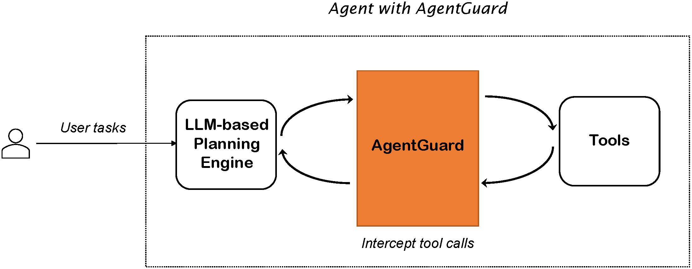
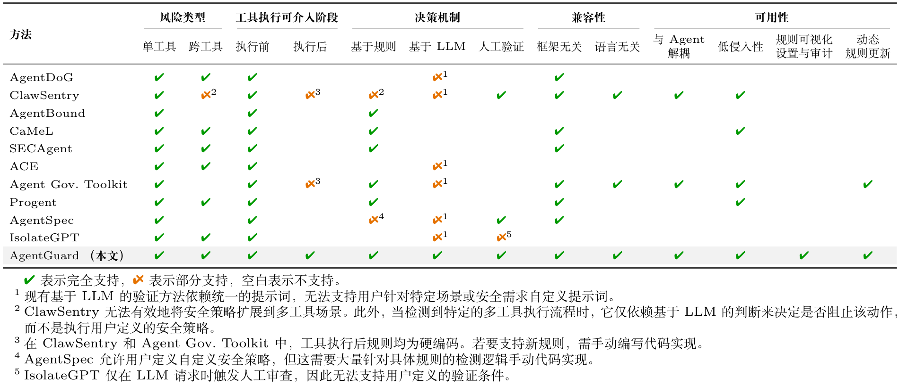
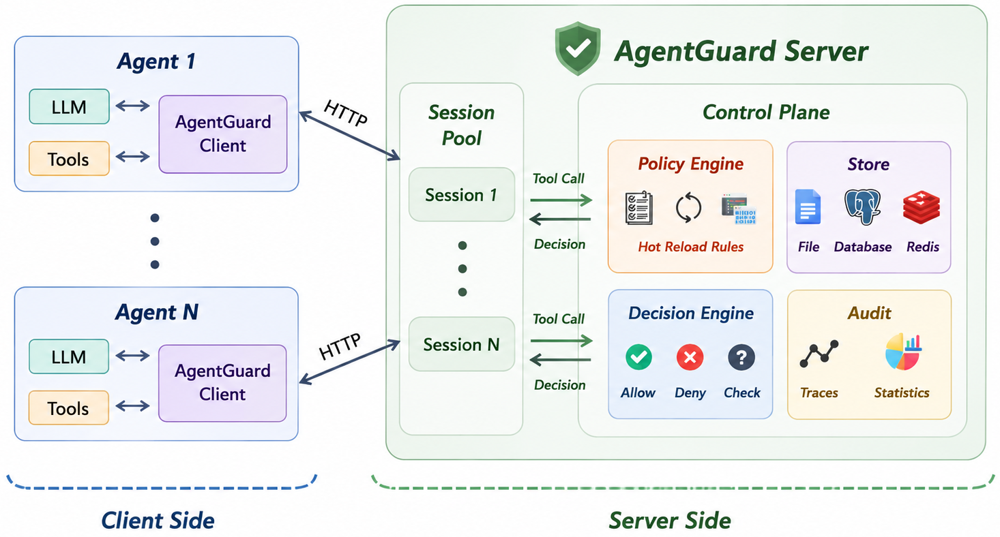
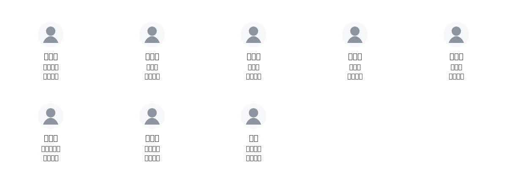

# 🛡️ AgentGuard

<p align="center">
  <a href="https://whitzard.tech/AgentGuard/zh/">
    
  </a>
  <a href="https://github.com/WhitzardAgent/AgentGuard/releases">
    
  </a>
  <a href="./LICENSE">
    
  </a>
</p>

<p align="center">
  <a href="./README.md">English</a> |
  <strong>简体中文</strong>
</p>

<p align="center">
  <strong>AgentGuard：面向 AI Agents 的零信任安全防护基座</strong>
</p>

<p align="center">
  无缝集成现有智能体框架，且通过模块化部署方式兼容已有基于规则/基于模型的安全防护方案。
</p>

<table align="center" width="100%" cellspacing="0" cellpadding="0">
  <tr>
    <td align="center" width="25%" style="padding: 20px 18px; border: 1px solid #e5e7eb; border-radius: 18px; background: #ffffff;">
      <div style="font-size: 28px; line-height: 1; margin-bottom: 10px;">🧩</div>
      <small><strong>无缝集成</strong></small>
    </td>
    <td align="center" width="25%" style="padding: 20px 18px; border: 1px solid #e5e7eb; border-radius: 18px; background: #ffffff;">
      <div style="font-size: 28px; line-height: 1; margin-bottom: 10px;">🧱</div>
      <small><strong>模块化安全防护策略</strong></small>
    </td>
    <td align="center" width="25%" style="padding: 20px 18px; border: 1px solid #e5e7eb; border-radius: 18px; background: #ffffff;">
      <div style="font-size: 28px; line-height: 1; margin-bottom: 10px;">🛡️</div>
      <small><strong>多风险覆盖</strong></small>
    </td>
    <td align="center" width="25%" style="padding: 20px 18px; border: 1px solid #e5e7eb; border-radius: 18px; background: #ffffff;">
      <div style="font-size: 28px; line-height: 1; margin-bottom: 10px;">👁️</div>
      <small><strong>可视化审计</strong></small>
    </td>
  </tr>
</table>


> [!IMPORTANT]
> 本项目仍处于活跃开发阶段，可能包含尚未发现的缺陷。欢迎通过 Issue 和 PR 提交反馈与贡献。

AgentGuard 是一套面向 AI Agents 的零信任安全防护基座，兼容已有安全防护策略。它会在每次调用大模型前、大模型输出后、工具调用前、执行完成后，根据安全配置识别与拦截安全风险，同时也支持通过可插拔 custom auditor 对已存储的运行轨迹进行事后审计。

目前，AgentGuard 已覆盖 Anthropic 的 [Zero Trust for AI Agents](https://claude.com/blog/zero-trust-for-ai-agents) 中强调的多个关键技术点，包括访问控制与权限管理、可观测性与审计，以及行为监控与响应。



AgentGuard 可以集成到现有的智能体框架中，无需修改底层的执行逻辑。目前，它支持 LangChain、AutoGen、OpenAI Agents SDK 和 [OpenClaw](https://github.com/openclaw/openclaw) 的集成，并且我们正在持续扩大对更多智能体生态系统和框架的支持。关于 OpenClaw 的 JavaScript 侧接入方式，可参考[OpenClaw 适配器文档](https://whitzard.tech/AgentGuard/zh/how-to-plugin/openclaw_adapter.html)。

## ✨ 功能特点

### 1. 多维度安全防护

#### 多阶段介入

在每次调用大模型前、大模型输出后、工具调用前、执行完成后，AgentGuard 都可以根据配置的安全策略进行识别与拦截，在智能体运行全流程中持续介入安全防护。此外，它还支持通过可插拔 custom auditor 对已存储的运行轨迹进行事后审计。

#### 无缝衔接已有安全防护策略

AgentGuard 提供统一接口，无缝适配已有安全防护策略。通过模块化 plugin 架构，用户可以根据实际需求动态接入和组合基于规则或基于模型的安全能力。目前 AgentGuard 已内置一套访问控制策略，并支持通过编写 DSL 的方式构建更多安全防护策略。

#### 单工具与跨工具防护

AgentGuard 既可以判断单次工具调用，也可以判断跨步骤攻击链。通过高效存储上下文信息，它能够有效检测“从数据库读取数据，然后发送电子邮件”“读取敏感文件，然后将其上传到外部 HTTP 端点”或“外部输入最终流入 Shell 命令”等行为。

### 2. 无缝集成现有智能体框架

AgentGuard 位于大模型规划引擎与工具之间，不介入智能体的规划、推理及任务编排逻辑。AgentGuard 为多种主流智能体框架提供了 Adapter，用户无需改动框架内部代码，也不用对现有智能体进行大规模重构，仅需极少量代码即可通过 Adapter 快速完成集成。对于暂未支持的智能体框架，AgentGuard 也提供了方便的开发接口让用户自定义 Adapter。请参考[客户端插件指南](https://whitzard.tech/AgentGuard/zh/plugins/custom_client_plugin.html)和[服务端插件指南](https://whitzard.tech/AgentGuard/zh/plugins/custom_server_plugin.html)。

目前我们支持的智能体框架有：
- [LangChain](https://github.com/langchain-ai/langchain)
- [AutoGen](https://github.com/microsoft/autogen)
- [OpenAI Agents SDK](https://github.com/openai/openai-agents-python)
- [OpenClaw](https://github.com/openclaw/openclaw)

可参考[OpenClaw 适配器文档](https://whitzard.tech/AgentGuard/zh/how-to-plugin/openclaw_adapter.html)。

### 3. 可视化策略配置与行为审计

AgentGuard 提供前端控制台来管理智能体。通过可视化页面，用户可以采用交互式的方式配置策略，无需手写 DSL 代码；同时策略配置界面广泛采用下拉框等选择性交互元素，极大降低了用户的策略配置负担。

运行时页面会展示智能体的健康状态、近期流量、待审批请求和审计记录。对于触发策略的工具调用，可以查看命中的规则、风险分数、最终决策以及原始事件/决策 JSON，便于定位为什么某次调用被拒绝或转入审核。

### 自定义审计器扩展

后端同样支持可插拔的自定义审计器，用于对执行后的轨迹进行复核。通用审计器抽象位于 `src/server/backend/audit/`，具体审计器实现位于 `src/server/backend/audit/auditors/`。详情请参考文档中的[自定义审计器章节](https://whitzard.tech/AgentGuard/zh/auditors.html)。

### 4. 集群管理

AgentGuard 采用集中式中控架构，实现对分布式智能体进程的统一治理。智能体可部署于网络中的多个节点，通过中控服务即可完成策略的集中配置与运行时状态的实时监控。这一架构特别适合需要统一管理众多智能体资产的组织场景。

## 🚀 快速开始

### 1. 先编写 Plugin 配置，再编写访问控制策略并启动中控服务

> 你需要先安装 Docker

选择一台主机作为中控服务器，然后执行以下命令下载 AgentGuard：

```bash
git clone https://github.com/WhitzardAgent/AgentGuard.git
cd AgentGuard
```

首先，先为中控服务编写一份 plugin 配置：

```bash
mkdir -p config

cat <<EOF > config/plugins.json
{
  "phases": {
    "llm_before": {
      "client": [],
      "server": []
    },
    "llm_after": {
      "client": [],
      "server": []
    },
    "tool_before": {
      "client": [],
      "server": [
        {
          "name": "rule_based_plugin",
          "env": {}
        }
      ]
    },
    "tool_after": {
      "client": [],
      "server": []
    }
  }
}
EOF
```

这份配置用于告诉 AgentGuard：在不同运行阶段分别启用哪些 plugin。这个 quick start 里，只有 `tool_before` 阶段启用了一个 server plugin：`rule_based_plugin`。这意味着 server 只会在工具真正执行之前，基于内置的规则型 plugin 去匹配访问控制策略；其他阶段都先保持为空。这样可以让第一个示例尽量简单：client 将工具调用前的判定请求发给 server，server 再用 `rule_based_plugin` 根据你写的策略返回 allow / deny 决策。

然后，再编写一套访问控制策略：
```bash
mkdir -p rules

cat <<EOF > rules/block_email_send.rules
RULE: block_untrusted_email_send
TRACE: Retriever -> ...? -> Mailer
CONDITION: Retriever.name == "retrieve_doc"
           AND Mailer.name == "send_email_to"
           AND Retriever.id == 0
           AND Mailer.addr != "admin@example.com"
           AND principal.trust_level < 2
POLICY: DENY
Severity: high
Category: data_exfiltration
Reason: "Low-trust principal cannot send document 0 to non-admin recipients"
EOF
```

该策略针对两个智能体工具：`retrieve_doc` 和 `send_email_to`，它们分别用于检索特定 id 的文档，以及将文档内容发送到指定的邮箱地址。这项策略描述了这么一个规则：信任级别小于 2 的智能体在执行任务时，只能将 id 为 0 的机密文件发送给 `admin@example.com` 邮箱，发送到其他地址一律不允许。

> AgentGuard 也提供了可视化策略配置方式，并支持策略的动态热更新，详情请参考[可视化策略配置文档](https://whitzard.tech/AgentGuard/zh/policies/quick_config.html)。

接下来配置中控服务的环境变量：

> 若使用默认配置，此步骤可省略。

```bash
cp .env.example .env
vi .env
```

在 `.env` 中补充 server plugin 配置文件路径：

```bash
AGENTGUARD_SERVER_PLUGIN_CONFIG=./config/plugins.json
```

启动中控服务：
```bash
./scripts/start.sh -d
```

中控服务监听在：`38080` 端口
UI 界面监听在：`38008` 端口

你可以通过访问 `http://localhost:38008` 来查看 UI 界面。

### 2. 智能体端的设置

切换到智能体端的主机，执行以下命令：

```bash
git clone https://github.com/WhitzardAgent/AgentGuard.git
cd AgentGuard
pip install -e .
```

以 LangChain 为例，准备一份智能体代码：

> 你需要先安装包依赖：
> ```bash
> pip install langchain==1.2.18
> pip install langchain-openai==1.2.1
> ```

```python
from langchain.agents import create_agent
from langchain.tools import tool

# 🚩 Import the AgentGuard client SDK
from agentguard import Guard, Principal

LLM_API_KEY = "<YOUR KEY>"         # Fill this manually
LLM_MODEL_NAME = "gpt-5.4-mini"

@tool
def retrieve_doc(id: int) -> str:
    """Retrieve a document by integer id."""
    return f"DOC#{id}: This is a mocked document body."

@tool
def send_email_to(doc: str, addr: str) -> str:
    """Send a document to an email address."""
    return f"Email has sent to {addr}: {doc}"

def build_llm():
    from langchain_openai import ChatOpenAI

    return ChatOpenAI(
        api_key=LLM_API_KEY,
        model=LLM_MODEL_NAME,
        temperature=0,
    )

def build_agent():
    return create_agent(
        model=build_llm(),
        tools=[retrieve_doc, send_email_to],
        system_prompt=(
            "You are a zero-shot ReAct style agent. Decide which tool to use, "
            "observe tool results, and continue until the user's task is complete."
        ),
    )

def run(agent, prompt):
    print("===================================")
    print(f"Prompt: {prompt}")
    result = agent.invoke(
        {
            "messages": [
                {
                    "role": "user",
                    "content": prompt,
                }
            ]
        }
    )
    print(f"Output: {result["messages"][-1].content}")
    print("===================================\n")

if __name__ == "__main__":
    agent = build_agent()

    # 🚩 Load the guard client
    guard = Guard(
        remote_url="http://<Control Server IP>:38080",      # Replace with your control server IP and port
        mode="enforce",
        fail_open=False,
    )

    # 🚩 Create a principal for the agent
    principal = Principal(
        agent_id="langchain-remote-demo",
        session_id="langchain-remote-session",
        role="default",
        trust_level=1,
    )

    # 🚩 Start a session with the principal
    guard.start(principal=principal, goal="langchain remote runnable host demo")

    # 🚩 Attach the guard to the LangChain agent
    guard.attach_langchain(agent)

    try:
        run(agent, "Please retrieve document id=0 and send it to admin@example.com.")
        run(agent, "Please retrieve document id=0 and send it to alice@example.com.")
    finally:
        # 🚩 Close the guard
        guard.close()
```

标 🚩 符号的地方是 AgentGuard 客户端插入智能体代码的位置，另外请注意在代码中将 LLM API 密钥和中控服务器的地址改为你实际部署对应的值。

### 3. 运行智能体

执行刚刚准备的 LangChain 智能体代码：

```bash
python <LANGCHAIN_AGENT_FILE>
```

智能体执行了两项不同的任务，第一次是将 id 为 0 的文档（模拟机密文件）发送给管理员邮箱，这是访问控制策略允许的操作；第二次是将 id 为 0 的文档发送给其他用户邮箱，这是访问控制策略不允许的操作。

预期行为是，AgentGuard 会允许第一次智能体执行，拒绝第二次智能体执行。

预期输出如下：
```
===================================
Prompt: Please retrieve document id=0 and send it to admin@example.com.
Output: Done — document 0 was retrieved and sent to admin@example.com.
===================================

===================================
Prompt: Please retrieve document id=0 and send it to alice@example.com.
Traceback (most recent call last):
  File "...", line 83, in <module>
    run(agent, "Please retrieve document id=0 and send it to alice@example.com.")
  ...
    raise DecisionDenied(
agentguard.models.errors.DecisionDenied: block_untrusted_email_send
During task with name 'tools' and id 'ab34afab-e0f3-14f6-7517-bba2e47f0ea6'
```

目前 AgentGuard 通过直接抛出异常来硬阻断智能体执行，后续版本会采用软阻断机制，在不阻断智能体进程的前提下，给大模型返回一个错误信息，提示智能体当前任务被拒绝。

### 4. 可视化管理智能体运行状态

您可以通过 UI 界面查看智能体的运行状态，审计策略执行日志。

UI 界面还支持策略可视化配置和动态热更新。

关于 AgentGuard 部署的其他细节，请参考[项目文档](https://whitzard.tech/AgentGuard/zh/)。

## 🎬 演示视频

https://github.com/user-attachments/assets/75a17e37-7f51-4c59-96fa-ea449eb79859

## 🏆 相比于现有框架的能力优势

现阶段，面向智能体的安全防护策略大致可分为两类：**模型恶意意图识别与拦截**，以及 **工具调用行为拦截**。前者通过模型微调增强底层 LLM 的鲁棒性，或基于模型的推理/思考过程识别潜在恶意意图；后者则在工具调用阶段，根据调用轨迹、参数与上下文执行预定义安全策略，对高风险操作进行识别、拦截或升级审批。

考虑到模型微调通常具有较高的训练与部署成本，且部分模型并不开放完整的思考过程，AgentGuard 将安全控制点部署在更实用的运行时阶段，包括 LLM 交互过程与工具执行过程。这种方式不依赖修改底层模型，而是直接围绕智能体“向模型输入了什么、模型输出了什么、实际执行了什么”建立安全防护，因此更容易集成到现有 Agent 系统中，也更适合生产环境落地。

如下图所示，现有基于工具调用行为的防护方案虽然能够覆盖部分安全需求，但大多仍停留在单点能力层面，例如仅做高危命令过滤、仅做特定风险拦截，或仅提供局部审计能力。相比之下，AgentGuard 提供了一套统一框架，更系统地覆盖访问控制、运行时行为监控与执行审计等核心能力，也更契合 Anthropic 在 [Zero Trust for AI Agents](https://claude.com/blog/zero-trust-for-ai-agents) 中强调的企业级 Agent 安全目标，例如最小权限、受约束的工具使用、可观测执行过程与可审计的策略执行。



## 🏗️ 架构

下图展示了 AgentGuard 的高层架构。

<p align="center">
  
</p>

- **客户端**：通过极少量代码修改，客户端可集成进智能体框架中，并能够在 LLM 调用前后、工具调用前后进行拦截。客户端可以先在本地执行轻量级过滤，再将事件发送到服务端，由服务端根据配置的 plugin 进一步检测。
- **服务器**：服务器接收来自客户端的信息，并根据配置的 plugin 对智能体动作进行策略评估，生成策略决策并返回给客户端；同时服务器持续监控智能体状态，供管理员进行审计。
- **Plugin 扩展**：客户端与服务器都支持可插拔 plugin。若需添加自定义 plugin，可参考[客户端 plugin 指南](https://whitzard.tech/AgentGuard/zh/plugins/custom_client_plugin.html)和[服务端 plugin 指南](https://whitzard.tech/AgentGuard/zh/plugins/custom_server_plugin.html)。
- **Custom Auditor 扩展**：后端也支持面向事后轨迹审计的可插拔 custom auditor。公共抽象位于 `src/server/backend/audit/`，具体 auditor 实现位于 `src/server/backend/audit/auditors/`。详见[自定义 auditor 文档](https://whitzard.tech/AgentGuard/zh/auditors.html)。

## 👥 贡献者



排名不分先后，感谢所有为 AgentGuard 贡献过想法、代码和反馈的朋友。

## 🎯 未来计划

- 支持更多主流的智能体框架
- 支持更多编程语言的智能体系统
- 启用多智能体场景的保护
- 扩展对 LLM 输入输出的监控与 plugin 覆盖范围
- 添加更丰富的策略执行动作
- 提供策略自动推荐的能力

## 📚 引用

如果你在研究工作中使用了 AgentGuard，请引用：

```bibtex
@misc{agentguard2026,
      title={AgentGuard: An Attribute-Based Access Control Framework for Tool-Use LLM-Based Agent},
      author={Jiaqi Luo* and Songyang Peng* and Jiarun Dai and Zhile Chen and Zhuoxiang Shen and Geng Hong and Xudong Pan and Yuan Zhang and Min Yang},
      year={2026},
      eprint={2605.28071},
      archivePrefix={arXiv},
      primaryClass={cs.CR},
      url={https://arxiv.org/abs/2605.28071},
}
```

## 📜 许可证

本项目基于 [GNU 通用公共许可证 v3.0（GPLv3）](./LICENSE) 开源。

## 📝 版本更新日志

### v2.1

- 兼容 LlamaIndex、Langflow。
- 兼容 AgentDoG plugin。
- 支持基于大模型的规则生成。

### v2.0

- 支持以模块化方式构建面向智能体安全的 Zero Trust 框架。
- 新增与 [OpenClaw](https://github.com/openclaw/openclaw) 和 JS client 的兼容能力。
