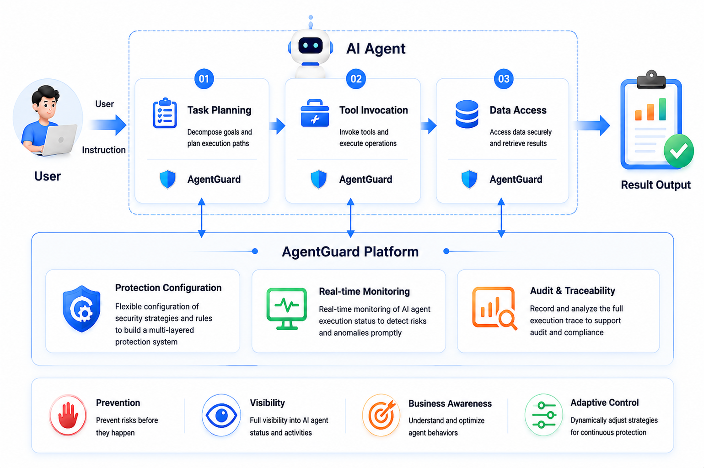

# Overview

> This project is still under active development and may contain bugs. Contributions via Issues and PRs are welcome.

AgentGuard is a zero-trust security foundation for AI agents. It integrates with existing agent frameworks and provides a configurable security layer across the full agent runtime: before each LLM call, after each LLM output, before each tool invocation, and after tool execution. It also supports post-hoc auditing over stored traces through pluggable custom auditors.

AgentGuard covers several key areas highlighted in Anthropic's [Zero Trust for AI Agents](https://claude.com/blog/zero-trust-for-ai-agents), including access control and privilege management, observability and auditing, and behavioral monitoring and response.

## What AgentGuard Provides

### Multi-phase security protection

AgentGuard can intervene throughout an agent run instead of only checking a single tool call. It can inspect LLM inputs, LLM outputs, tool invocations, and tool results, then allow, deny, escalate, or record decisions according to configured safeguards.

### Modular security strategies

AgentGuard exposes a unified plugin architecture so rule-based and model-based security strategies can be plugged in behind the same interface. The current release includes built-in plugins such as the server-side `rule_based_plugin`, which can either return fixed `ALLOW` / `DENY` decisions directly or escalate to `HUMAN_CHECK` / `LLM_CHECK` so a human or LLM can decide the final allow-or-deny outcome based on the matched condition and context, and `jailbreak_check` for prompt-injection detection in `llm_before`.

### Single-tool and cross-tool protection

AgentGuard can evaluate both individual tool calls and cross-step attack chains. By storing runtime context, it can detect patterns such as:

- read from a database, then send email
- read a sensitive file, then upload it to an external HTTP endpoint
- external input eventually flows into a shell command

### Seamless framework integration

AgentGuard sits between the LLM-based planning engine and tools. It does not replace the agent's planning, reasoning, or task orchestration logic. Adapters are provided for mainstream agent frameworks, so users can integrate AgentGuard with minimal code changes and without modifying framework internals.

Currently supported frameworks include:

- [LangChain](https://github.com/langchain-ai/langchain)
- [LangGraph](https://github.com/langchain-ai/langgraph)
- [LlamaIndex](https://github.com/run-llama/llama_index)
- [AutoGen](https://github.com/microsoft/autogen)
- [OpenAI Agents SDK](https://github.com/openai/openai-agents-python)
- OpenClaw

### Visual policy configuration and audit

AgentGuard ships with a web console for managing agents. The console supports interactive policy configuration, runtime monitoring, pending approval review, and audit inspection. For any tool call that triggers a policy, users can inspect matched rules, risk scores, final decisions, and raw event or decision JSON.

### Centralized control-plane management

AgentGuard uses a centralized control-plane architecture for distributed agent processes. Agents can run across multiple nodes, while policy configuration, runtime monitoring, and audit workflows are managed centrally by the control server. This is useful for organizations that need unified governance across many agent deployments.

## Architecture

At a high level:

- **Client**: integrates into agent frameworks, intercepts LLM and tool events, performs lightweight local filtering, and forwards events to the server when needed.
- **Server**: receives runtime information from clients, evaluates configured plugins and policies, returns decisions, and stores trace data for monitoring and auditing.
- **Plugins**: extend runtime inspection on the client or server side.
- **Custom auditors**: run post-hoc analysis over stored traces to support review, compliance, and incident investigation.

## When to Use AgentGuard

AgentGuard is most useful when agents can interact with real resources, especially:

- outbound tools such as email, HTTP, or messaging
- shell and system-command tools
- filesystem read or write tools
- database read or write tools
- workflows where untrusted input may influence later actions

Even without tool calls, AgentGuard can still inspect and intercept security risks in LLM inputs and outputs. If an agent is purely conversational and has very low risk, AgentGuard may be optional. If the agent handles sensitive prompts, untrusted inputs, regulated content, system data, or any action that can affect systems, data, or external destinations, AgentGuard provides a clear, configurable, and auditable control layer.
