# Quick Configuration

The easiest way to configure policies is through the web UI, which provides an interactive, step-by-step interface with dropdowns and form fields to reduce the manual effort of policy writing.

Open the UI and select the `Agents` tab to see all agents currently connected to the control server.

> Note: An agent must actively connect to the control server before it can be discovered and have policies configured for it.

In this example, a LangChain agent has connected to the control server, as shown below:

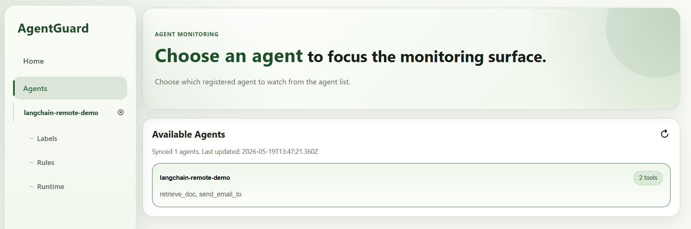

The system automatically detects that the agent has two built-in tools: `retrieve_doc` and `send_email_to`.

Click the `Rules` tab on the left to enter the policy configuration interface. We want to ensure that the document retrieved by `retrieve_doc` with id 0 (a simulated confidential file) can only be sent to `admin@example.com`. As shown below, the UI guides you through four steps, starting with entering a rule name:

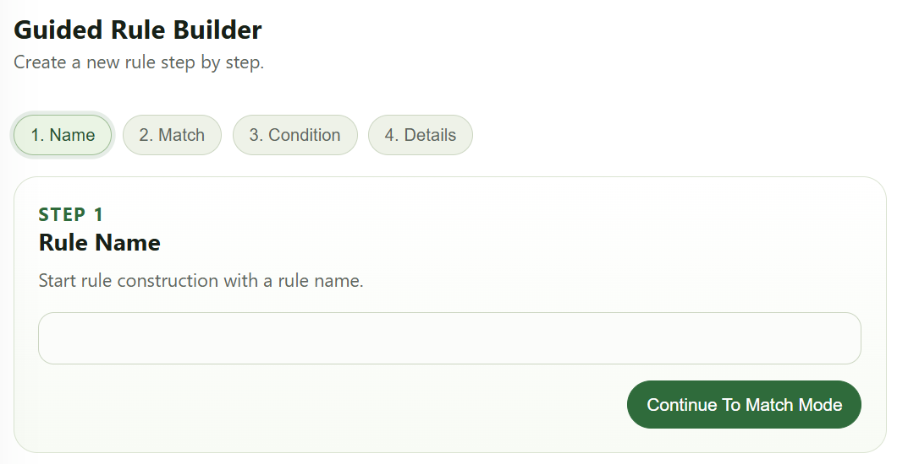

After entering the rule name, step 2 asks you to choose between a single-tool rule and a chain-path rule. Our policy targets the combined behavior of two tools, which is a typical chain-path rule, so select `Tool Trace` in the `Formal Match Mode` dropdown:

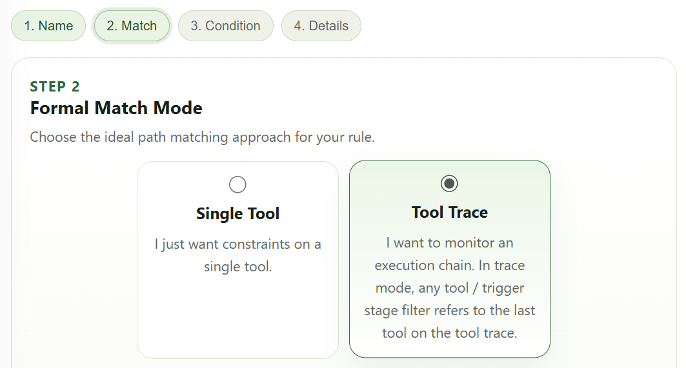

Next, in the `Trace format` section at the bottom of the page, use the `+` button to add three placeholders: `Tool A`, `...?`, and `Tool C`. The `...?` placeholder means there can be zero or more tool calls between `Tool A` and `Tool C`. After adding them, it looks like this:

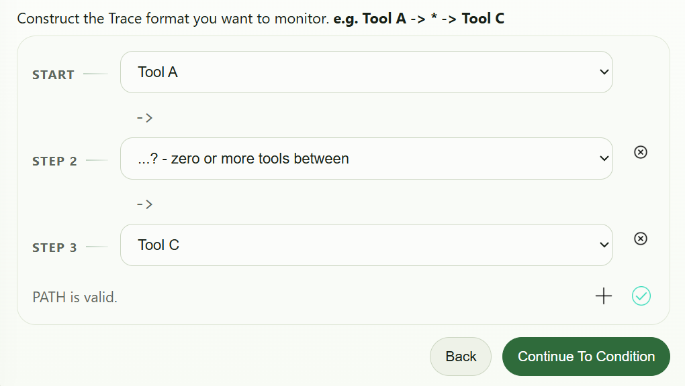

Once the `Trace format` is set, click the green checkmark at the bottom right to confirm, then click `Continue to Condition` to proceed to step 3. Now we need to bind `Tool A` and `Tool C` to specific tools and parameters. For `Tool A`, the tool name is `retrieve_doc`. Press the `+` button in the `Saved Conditions` section, and the UI will walk you through three sub-steps to build a constraint:

(1) Select the tool to constrain: `Tool A`
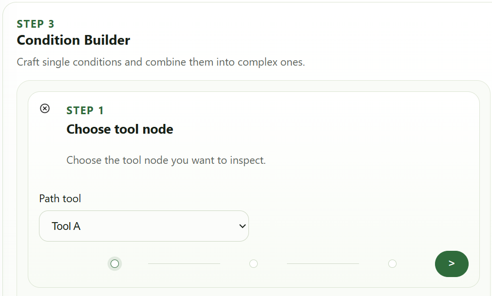

(2) Select the property to constrain: `Tool name`
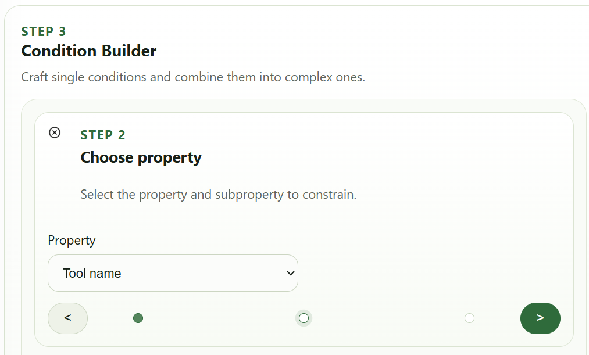

(3) Choose the comparison operator `==` and the target value `retrieve_doc`
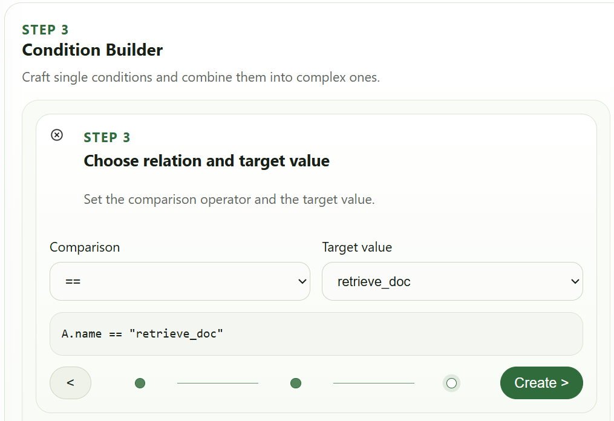

Click the `Create >` button, and the system will create a constraint condition. Follow the same steps to bind `Tool C` to the tool name `send_email_to`.

After binding the tool names, the next step is to constrain the tool parameter values:
* `retrieve_doc` tool: parameter `id == 0`
* `send_email_to` tool: parameter `addr != "admin@example.com"`

Let's walk through the `retrieve_doc.id` parameter as an example. Again, press the `+` button in `Saved Conditions` and select `Tool A` in the first sub-step. In the second sub-step, since we are constraining a tool parameter rather than a tool name, select `Tool syntax` from the `Property` dropdown. A `Sub-property` dropdown will appear on the right — select `param-id` (where `param-` is the parameter name prefix and the rest is the actual parameter name `id`):

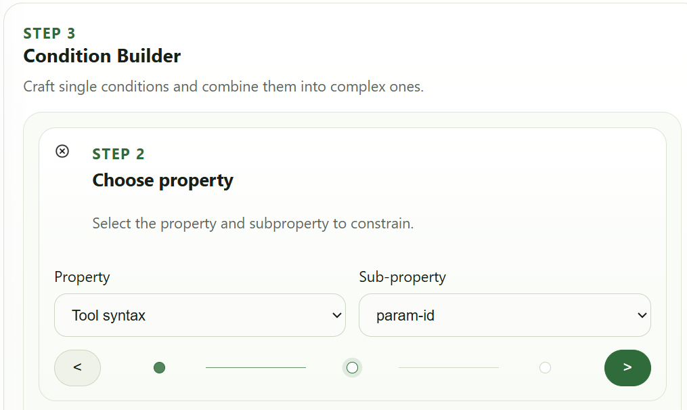

Then choose the comparison operator `==` and the constraint value `0`:

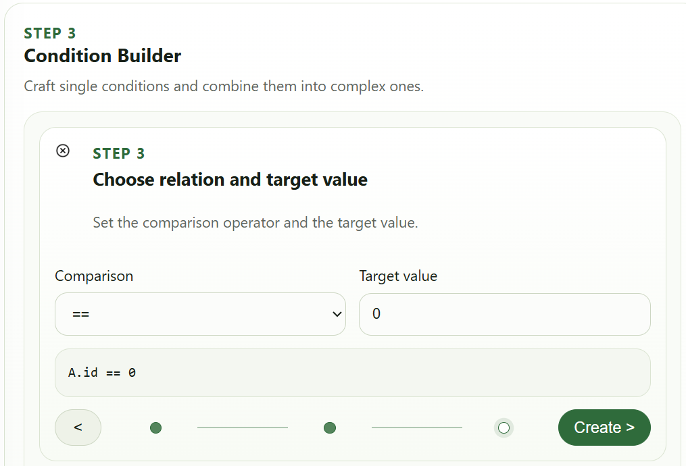

The `send_email_to.addr` constraint is set up similarly, except you should choose `!=` as the comparison operator.

After the above steps, you will have four constraints in `Saved Conditions`. All four must be satisfied simultaneously to block the agent's execution, so in the `Logic Canvas`, connect them with `AND`:

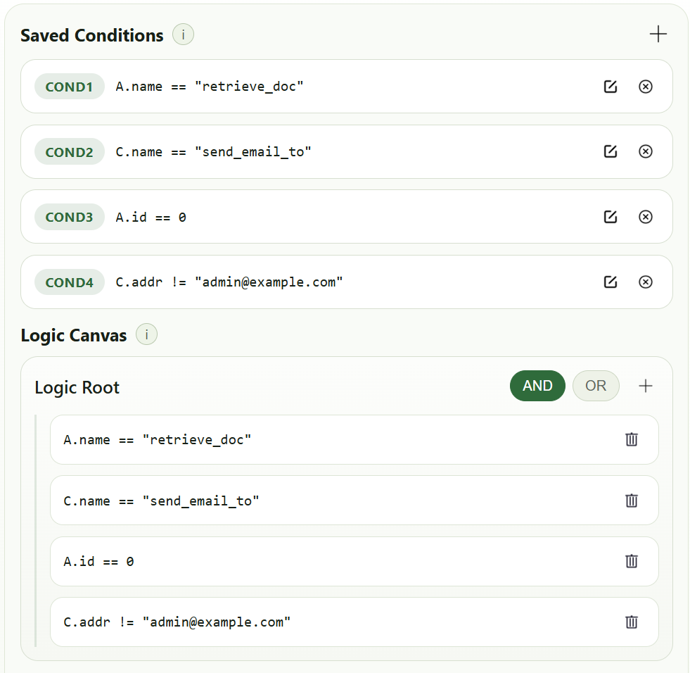

The final step is to configure the action to take when the policy matches, along with policy metadata. Since we want to block execution on match, set `ACTION` to `DENY`. The remaining fields — `Severity`, `Category`, and `Reason` — can be filled in as needed:

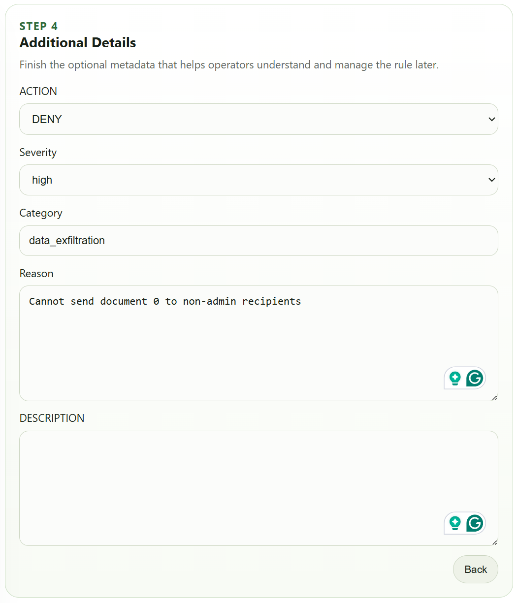

Notice that as you configure the policy interactively, the system generates a preview of the DSL in parallel:

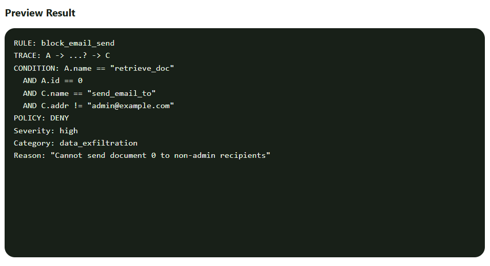

Once everything looks correct, click the `Generate Rule` button. The system will create the policy, **but it won't take effect until you manually Publish it in the Rule List**.

You can monitor agent runtime status and policy enforcement under the `DashBoard` tab:

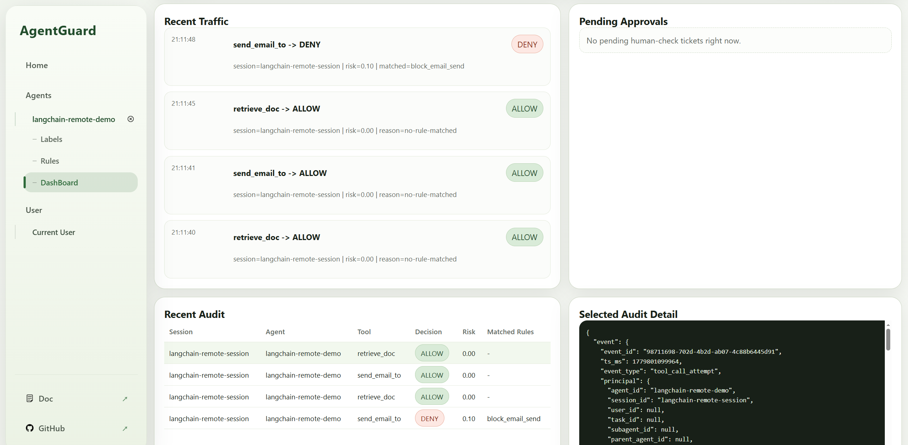

> Note: While the UI covers the vast majority of policy expressions, some DSL syntax features are not yet exposed in the UI. We will continue to improve coverage in future updates.
