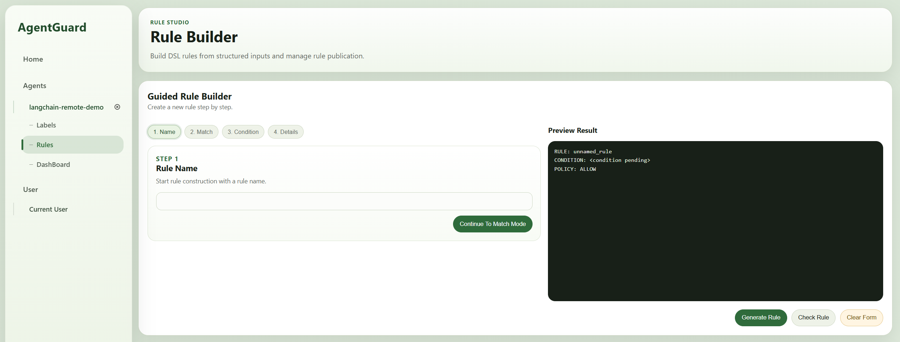

# 快速部署

## 环境准备
* Python >= 3.11
* pip
* Docker （如使用 Docker 部署）

## 构建步骤

### 第 1 步：准备一份智能体的代码
为了对目标智能体进行访问控制，你需要有一份该智能体的代码。这里以 LangChain 为例，编写一个最简单的 Zero Shot ReAct 智能体。

#### 1. 安装 LangChain
```bash
pip install langchain==1.2.18
pip install langchain-openai==1.2.1
```
> 本指南以 LangChain 1.2.18 版本为例，你也可以使用其他方式构建智能体。

#### 2. 编写智能体代码
```python
from langchain.agents import create_agent
from langchain.tools import tool

LLM_API_KEY = "<YOUR KEY>"         # Fill this manually
LLM_MODEL_NAME = "gpt-5.4-mini"

@tool
def retrieve_doc(id: int) -> str:
    """Retrieve a document by integer id."""
    return f"DOC#{id}: This is a mocked document body."

@tool
def send_email_to(doc: str, addr: str) -> str:
    """Send a document to an email address."""
    return f"Email has sent to {addr}: {doc}"

def build_llm():
    from langchain_openai import ChatOpenAI

    return ChatOpenAI(
        api_key=LLM_API_KEY,
        model=LLM_MODEL_NAME,
        temperature=0,
    )

def build_agent():
    return create_agent(
        model=build_llm(),
        tools=[retrieve_doc, send_email_to],
        system_prompt=(
            "You are a zero-shot ReAct style agent. Decide which tool to use, "
            "observe tool results, and continue until the user's task is complete."
        ),
    )

def run(agent, prompt):
    print("===================================")
    print(f"Prompt: {prompt}")
    result = agent.invoke(
        {
            "messages": [
                {
                    "role": "user",
                    "content": prompt,
                }
            ]
        }
    )
    print(f"Output: {result["messages"][-1].content}")
    print("===================================\n")

if __name__ == "__main__":
    agent = build_agent()

    run(agent, "Please retrieve document id=0 and send it to admin@example.com.")
    run(agent, "Please retrieve document id=0 and send it to alice@example.com.")
```

### 第 2 步：AgentGuard Client Importing
你需要在前面编写的智能体代码基础上导入我们的访问控制客户端，以便于与中控服务进行通信，传递智能体当前的运行状态，并接受中控服务的访问控制指令。

#### 1. 安装 AgentGuard 的访问控制客户端 SDK
```bash
git clone https://github.com/WhitzardAgent/AgentGuard.git
cd AgentGuard
pip install -e .
```

#### 2. 导入访问控制客户端
下面是基于第 1 步编写的智能体代码，导入我们的访问控制客户端后的完整示例代码，标 🚩 符号的地方是客户端的插入位置：
```python
from langchain.agents import create_agent
from langchain.tools import tool

# 🚩 Import the AgentGuard client SDK
from agentguard import Guard, Principal

LLM_API_KEY = "<YOUR KEY>"         # Fill this manually
LLM_MODEL_NAME = "gpt-5.4-mini"

@tool
def retrieve_doc(id: int) -> str:
    """Retrieve a document by integer id."""
    return f"DOC#{id}: This is a mocked document body."

@tool
def send_email_to(doc: str, addr: str) -> str:
    """Send a document to an email address."""
    return f"Email has sent to {addr}: {doc}"

def build_llm():
    from langchain_openai import ChatOpenAI

    return ChatOpenAI(
        api_key=LLM_API_KEY,
        model=LLM_MODEL_NAME,
        temperature=0,
    )

def build_agent():
    return create_agent(
        model=build_llm(),
        tools=[retrieve_doc, send_email_to],
        system_prompt=(
            "You are a zero-shot ReAct style agent. Decide which tool to use, "
            "observe tool results, and continue until the user's task is complete."
        ),
    )

def run(agent, prompt):
    print("===================================")
    print(f"Prompt: {prompt}")
    result = agent.invoke(
        {
            "messages": [
                {
                    "role": "user",
                    "content": prompt,
                }
            ]
        }
    )
    print(f"Output: {result["messages"][-1].content}")
    print("===================================\n")

if __name__ == "__main__":
    agent = build_agent()

    # 🚩 Load the guard client
    guard = Guard(
        remote_url="http://<Control Server IP>:38080",      # Replace with your control server IP and port
        mode="enforce",
        fail_open=False,
    )

    # 🚩 Create a principal for the agent
    principal = Principal(
        agent_id="langchain-remote-demo",
        session_id="langchain-remote-session",
        role="default",
        trust_level=1,
    )

    # 🚩 Start a session with the principal
    guard.start(principal=principal, goal="langchain remote runnable host demo")

    # 🚩 Attach the guard to the LangChain agent
    guard.attach_langchain(agent)

    try:
        run(agent, "Please retrieve document id=0 and send it to admin@example.com.")
        run(agent, "Please retrieve document id=0 and send it to alice@example.com.")
    finally:
        # 🚩 Close the guard
        guard.close()
```

* `Guard()`: 用于定义中控服务器地址、这部分需要与中控服务的配置保持一致，详见下方的中控服务部署部分
* `Principal()`: 用于定义智能体的身份，包括智能体的 ID、会话 ID、角色、信任级别等。这些信息将被用于访问控制策略编写时面向特定属性构建约束
* `guard.start()`: 用于启动访问控制会话，将智能体的身份与任务目标关联起来，开始与中控服务进行通信。需要在智能体执行任务前调用
* `guard.attach_langchain()`: 用于将访问控制客户端与 LangChain 智能体实例关联起来。不同智能体平台需要调用不同的 adapter，针对其他平台的处理方法请参考后续章节
* `guard.close()`: 用于关闭访问控制会话，释放资源。需要在智能体执行完所有任务后调用

### 第 3 步：AgentGuard Checkers

AgentGuard 同时支持部署在 client 和 server 两侧的 checker。两侧共享同一套标准化运行时 schema，但可见信息范围不同，部署位置也不同。若需要查看实现级细节，可参考 `../../src/client/python/agentguard/checkers/README_CN.md` 和 `../../src/server/backend/runtime/checkers/README_CN.md`。

#### 1. Client 与 Server Checker 的区别

- **Client checker** 运行在智能体进程本地，只接收当前 `event: RuntimeEvent` 和 `context: RuntimeContext`，适合低延迟、轻量级的本地过滤。
- **Server checker** 运行在中控服务端，除了当前 `event` 和 `context`，还会接收到 `trajectory_window: list[RuntimeEvent]`，适合做跨步骤攻击链检测、集中策略评估与审计。
- Client checker 文件需要放在 `../../src/client/python/agentguard/checkers/<phase>/`。
- Server checker 文件需要放在 `../../src/server/backend/runtime/checkers/<phase>/`。

#### 2. RuntimeEvent

`RuntimeEvent` 是 client 与 server checker 共同使用的标准化事件对象：

```python
RuntimeEvent(
    event_id: str,
    event_type: EventType,
    timestamp: float,
    context: RuntimeContext,
    payload: dict[str, Any],
    risk_signals: list[str] = [],
    metadata: dict[str, Any] = {},
)
```

- `event_id`：当前运行时事件的唯一标识。
- `event_type`：当前事件所处的运行阶段，当前有效值包括 `LLM_INPUT`、`LLM_OUTPUT`、`TOOL_INVOKE` 和 `TOOL_RESULT`。
- `timestamp`：事件创建时间。
- `context`：挂载在该事件上的共享运行上下文。
- `payload`：checker 实际要读取和判断的阶段数据。
- `risk_signals`：前序 checker 或 plugin 已经附加到事件上的风险标签。
- `metadata`：事件附带的额外调试信息或 adapter 自定义信息。

常见的 payload 结构如下：

```python
# LLM_INPUT
{"messages": [...]} 
{"text": "..."}  # 兼容/简化适配场景

# LLM_OUTPUT
{"output": ...}

# TOOL_INVOKE
{
    "tool_name": "send_email",
    "arguments": {"to": "...", "body": "..."},
    "capabilities": ["external_send"],
}

# TOOL_RESULT
{
    "tool_name": "read_file",
    "result": ...,
    "error": None,
}
```

#### 3. RuntimeContext

`RuntimeContext` 是在同一个 session 中跨事件传播的上下文对象：

```python
RuntimeContext(
    session_id: str,
    user_id: str | None = None,
    agent_id: str | None = None,
    task_id: str | None = None,
    policy: str | None = None,
    policy_version: str | None = None,
    environment: str | None = None,
    metadata: dict[str, Any] = {},
)
```

- `session_id`：必填的会话标识，用来把同一次运行中的所有事件关联起来。
- `user_id`：可选，表示发起本次请求的最终用户身份。
- `agent_id`：可选，表示当前智能体实例或服务身份。
- `task_id`：可选，表示当前任务、工作流或执行单元的标识。
- `policy`：可选，表示当前会话关联的策略名称、来源或模式。
- `policy_version`：可选，表示策略版本号或快照标识。
- `environment`：可选，表示运行环境，例如 `dev`、`staging` 或 `prod`。
- `metadata`：自由扩展的附加上下文，例如租户信息、框架标签或 adapter 自定义字段。

#### 4. `trajectory_window: list[RuntimeEvent]`

`trajectory_window` 只会提供给 server 侧 checker。

- 它表示同一个 session 的最近事件窗口。
- 列表中的每一个元素都是一个完整的 `RuntimeEvent`。
- 当检测逻辑依赖执行历史，而不是只看当前事件时，就应该使用它。
- 典型场景包括“前一个工具结果读出了敏感数据，后一个工具调用又尝试把它发送到外部”或“来自不可信 LLM 输出的内容最终流入 Shell 命令”。

Client checker 拿不到 `trajectory_window`。如果你的检测逻辑依赖历史轨迹，就应该把它实现为 server checker。实际运行时，server 看到的窗口既可能来自正常运行轨迹，也可能包含 client 后续同步上来的本地最终决策缓存。

#### 5. Custom Checker

##### Client-side checker

Client checker 需要放到与事件阶段对应的目录中：

```text
../../../src/client/python/agentguard/checkers/llm_before/
../../../src/client/python/agentguard/checkers/llm_after/
../../../src/client/python/agentguard/checkers/tool_before/
../../../src/client/python/agentguard/checkers/tool_after/
```

示例：

```python
from agentguard.checkers.base import BaseChecker, CheckResult
from agentguard.checkers.registry import register
from agentguard.schemas.context import RuntimeContext
from agentguard.schemas.events import EventType, RuntimeEvent


@register(
    name="my_client_checker",
    description="Detect risky tool arguments on the client side.",
)
class MyClientChecker(BaseChecker):
    event_types = [EventType.TOOL_INVOKE]

    def check(self, event: RuntimeEvent, context: RuntimeContext) -> CheckResult:
        tool_name = event.payload.get("tool_name")
        arguments = event.payload.get("arguments") or {}
        if tool_name == "send_email" and arguments.get("to", "").endswith("@external.com"):
            return CheckResult(risk_signals=["external_send"])
        return CheckResult.empty()
```

##### Server-side checker

Server checker 需要放到对应的服务端目录中：

```text
../../../src/server/backend/runtime/checkers/llm_before/
../../../src/server/backend/runtime/checkers/llm_after/
../../../src/server/backend/runtime/checkers/tool_before/
../../../src/server/backend/runtime/checkers/tool_after/
```

示例：

```python
from backend.runtime.checkers.base import BaseChecker, CheckResult
from backend.runtime.checkers.registry import register
from shared.schemas.context import RuntimeContext
from shared.schemas.events import EventType, RuntimeEvent


@register(
    name="my_server_checker",
    description="Detect multi-step exfiltration on the server side.",
)
class MyServerChecker(BaseChecker):
    event_types = [EventType.TOOL_INVOKE]

    def check(
        self,
        event: RuntimeEvent,
        context: RuntimeContext,
        trajectory_window: list[RuntimeEvent] | None = None,
    ) -> CheckResult:
        trajectory_window = trajectory_window or []
        if trajectory_window and event.payload.get("tool_name") == "send_email":
            return CheckResult(risk_signals=["cross_step_review"])
        return CheckResult.empty()
```

Server 还内置了一个基于规则的 checker，位置在 `../../../src/server/backend/runtime/checkers/tool_before/rule_based_check/checker.py`，它的注册名是 `rule_based_check`。

##### Checker 配置

加入 checker 类之后，需要在 checker 配置中引用它们的注册名：

```json
{
  "phases": {
    "tool_before": {
      "local": ["my_client_checker"],
      "remote": ["rule_based_check", "my_server_checker"]
    }
  }
}
```

- `local` 由 client 侧 checker manager 加载。
- `remote` 由 server 侧 checker manager 加载。
- 即使两个注册名出现在同一份配置文件里，对应实现文件仍然必须分别部署到正确的 client 或 server 目录下。

### 第 4 步：在中控服务器上编写策略并启动中控服务
该项目采用 C/S 架构，访问控制的所有管理操作，包括智能体的状态监控、策略配置、策略执行、访问控制指令下发等，都需要在中控服务器上进行。该架构尤其有利于一个组织内部有多套智能体资产时，能够统一管理。

虽然中控服务和智能体可以运行在同一个主机上，但是我们建议中控服务单独部署在一台主机上，以提高系统的可扩展性。下面的教程默认你选择了一台独立的主机来搭载中控服务。

首先，在中控服务器上克隆本项目
```bash
git clone https://github.com/WhitzardAgent/AgentGuard.git
cd AgentGuard
```

#### 1. 先编写一份 checker 配置文件

在编写访问控制策略之前，先定义这个 quick start 里 server 侧要启用哪个 checker：

```bash
mkdir -p config

cat <<EOF > config/checkers.json
{
  "phases": {
    "llm_before": {
      "local": [],
      "remote": []
    },
    "llm_after": {
      "local": [],
      "remote": []
    },
    "tool_before": {
      "local": [],
      "remote": ["rule_based_check"]
    },
    "tool_after": {
      "local": [],
      "remote": []
    }
  }
}
EOF
```

这份配置的含义是：只有 `tool_before` 阶段启用了一个远端 checker，也就是内置的 `rule_based_check`；其他阶段全部留空。换句话说，server 只会在工具真正执行之前，根据你编写的访问控制策略去做规则匹配和 allow / deny 判定。这样可以让 quick start 聚焦在“工具调用前的访问控制”这一条主线，不引入额外的 LLM 阶段或 tool result 阶段 checker。

#### 2. 为智能体编写一套访问控制策略
我们刚才编写的智能体包含两个工具：`retrieve_doc` 和 `send_email_to`，分别用于检索特定 id 的文档，以及将文档内容发送到指定的邮箱地址。假设我们希望信任级别小于 2 的智能体在执行任务时，只能将 id 为 0 的机密文件发送给 `admin@example.com` 邮箱，发送到其他地址一律不允许，我们可以创建一个策略文件：
```bash
mkdir -p rules

cat <<EOF > rules/block_email_send.rules
RULE: block_untrusted_email_send
TRACE: Retriever -> ...? -> Mailer
CONDITION: Retriever.name == "retrieve_doc"
           AND Mailer.name == "send_email_to"
           AND Retriever.id == 0
           AND Mailer.addr != "admin@example.com"
           AND principal.trust_level < 2
POLICY: DENY
Severity: high
Category: data_exfiltration
Reason: "Low-trust principal cannot send document 0 to non-admin recipients"
EOF
```

AgentGuard 为智能体的访问控制策略专门设计了一套 DSL 语法，我们将在[DSL基本结构](./policies/dsl_basic_structure.md)章节中详细介绍它。

#### 3. 部署 AgentGuard 中控服务
我们提供了 Docker 部署和源码部署两种方式。

##### Docker 部署 【推荐方式】
> 你需要先自行安装 Docker。

Docker 部署相当简单。先在 `.env` 中设置 checker 配置文件路径：

```bash
cp .env.example .env
# 然后补充：
# AGENTGUARD_SERVER_CHECKER_CONFIG=./config/checkers.json
```

再在项目根目录下执行以下命令即可：

```bash
./scripts/start.sh -d
```

中控服务默认监听在 `38080` 端口。

我们还提供了 UI 界面，支持可视化的方式监控智能体运行状态，审计策略执行记录，以及支持通过交互式的方式配置访问控制策略。对于新手来说，我们推荐使用 UI 界面来管理智能体的访问控制。您可以在浏览器中访问 `http://localhost:38008` 来查看 UI 界面。

下面是通过 UI 界面，以交互式方式配置访问控制策略的展示图：



我们将在[策略快速配置](./policies/quick_config.md)章节中详细介绍如何通过交互式方式配置访问控制策略。

##### 源码部署
若选择源码部署，你需要手动安装依赖

```bash
pip install -e ".[server]"
```

接着启动中控服务
```bash
AGENTGUARD_SERVER_CHECKER_CONFIG=./config/checkers.json \
python -m agentguard serve \
    --host 0.0.0.0 \
    --port 38080 \
    --policy rules/block_email_send.rules
```

* `--port`: 中控服务监听的端口号
* `--policy`: 访问控制策略的文件路径，可通过`--policy fileA --policy fileB ...`指定多个策略文件

你也可以启动 UI 界面
```bash
./scripts/run-frontend.sh
```

通过访问 `http://localhost:8008` 来查看 UI 界面。

### 第 5 步：运行智能体代码
回到搭载智能体的主机，运行智能体代码：
```bash
python <LANGCHAIN_AGENT_FILE>
```

预期行为是：智能体在执行第一次任务时，机密文件发给了 `admin@example.com` 邮箱，任务得以成功执行。在执行第二次任务时，智能体尝试将机密文件发送给 `alice@example.com`，将会弹出异常，拒绝执行。

预期输出结果如下：
```
===================================
Prompt: Please retrieve document id=0 and send it to admin@example.com.
Output: Done — document 0 was retrieved and sent to admin@example.com.
===================================

===================================
Prompt: Please retrieve document id=0 and send it to alice@example.com.
Traceback (most recent call last):
  File "...", line 83, in <module>
    run(agent, "Please retrieve document id=0 and send it to alice@example.com.")
  ...
    raise DecisionDenied(
agentguard.models.errors.DecisionDenied: block_untrusted_email_send
During task with name 'tools' and id 'ab34afab-e0f3-14f6-7517-bba2e47f0ea6'
```
