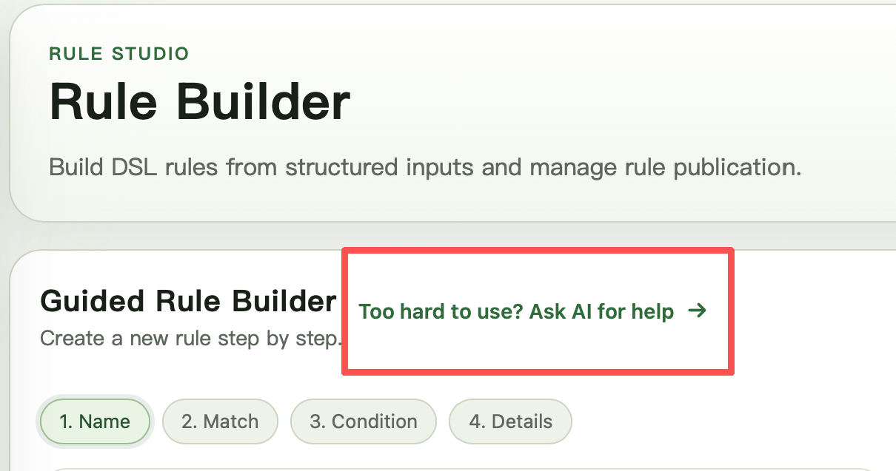
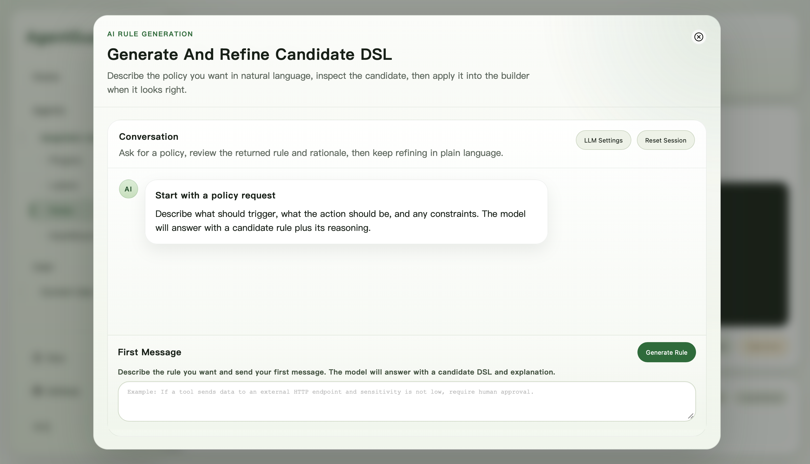

# rule_based_plugin 可视化策略配置

本文介绍如何通过 Web UI 为内置的 `rule_based_plugin` server plugin 配置策略。`rule_based_plugin` 用于执行访问控制规则，通常运行在 `tool_before` 阶段，让 AgentGuard 可以在工具真正执行前识别工具调用中的安全风险。命中的规则既可以直接返回 `ALLOW` 或 `DENY`，也可以转交给人工或 LLM 来决定最终是 allow 还是 deny。

要让这些策略在运行时生效，需要先在 `config/plugins.json` 中启用该 plugin：

```json
{
  "phases": {
    "llm_before": {"client": [], "server": []},
    "llm_after": {"client": [], "server": []},
    "tool_before": {
      "client": [],
      "server": [{"name": "rule_based_plugin", "env": {}}]
    },
    "tool_after": {"client": [], "server": []}
  }
}
```

对于普通用户来说，最方便快捷的办法是使用我们提供的 UI 界面，通过交互式的方式来配置 `rule_based_plugin` 策略。UI 界面大量采用下拉框选择的方式，减少了用户的策略配置负担。如果你准备使用 `LLM_CHECK`，还要确保 plugin 的 `env` 里补充 reviewer 配置，例如 `llm_backend`、`llm_model`、`llm_base_url` 和 `llm_api_key`，并直接填写具体值。

打开 UI 界面，选择 `Agents` 选项卡，可以看到当前所有连接到中控服务的智能体。

> 注意：你必须要让智能体主动连接到中控服务，才能发现智能体并后续为它配置策略。

目前我们发现 LangChain 智能体已连接到中控服务，如图所示：


系统能够自动识别到该智能体有两个内置工具，分别为 `retrieve_doc` 和 `send_email_to`。

我们点击左侧的 `Rules` 选项卡，进入交互式策略配置界面。这个界面支持两种配置方式：一种是与 LLM 对话，让它帮助你生成规则；另一种是通过分步式 UI 人工编写规则。

#### 方式一：通过 LLM 对话生成规则

用户首先需要点击 `Ask AI for help`：



随后会进入 LLM 对话界面。设置好 LLM API 等相关信息后，即可通过自然语言描述策略需求，让 LLM 帮助生成规则。对于生成出来的规则，用户可以选择直接采用，也可以继续在对话中迭代优化；一旦选择采用，该规则会直接 apply 到当前 agent 的规则库中。



#### 方式二：人工编写规则

我们希望从 `retrieve_doc` 工具中获取的 id 为 0 的文档内容（模拟机密文件），只能发送到 `admin@example.com` 这个邮箱。从图中我们可以看到，UI 界面将从填写规则名开始，通过四个步骤，一步一步引导用户完成策略配置。


填写完规则名后，在第二步我们首先要选择是单工具规则还是链式路径规则，我们的策略针对的是两个工具的组合行为，是一个典型的链式路径规则，因此在 `Formal Match Mode` 中要选择 `Tool Trace`，如图所示：


接下来在页面下方的 `Trace format` 处通过 `+` 号添加 3 个占位符，分别是 `Tool A`, `...?` 和 `Tool C`。`...?` 表示 `Tool A` 和 `Tool C` 中可以有零个或多个工具调用，添加完后如图所示：


设置完 `Trace format` 后要点击右下角的绿色小勾确认，然后点击 `Continue to Condition` 按钮进入第三步。此时我们要把 `Tool A` 和 `Tool C` 绑定到具体的工具和参数上，`Tool A` 的工具名为 `retrieve_doc`，我们在 `Saved Conditions` 处按下 `+` 号，UI 界面会通过三个子步骤引导用户构建约束条件：

（1）选择需要约束的工具：`Tool A` 


（2）选择需要约束的属性：`Tool name`


（3）选择比较关系 `==` 以及约束值 `retrieve_doc`


点击 `Create >` 按钮，系统会创建一个约束条件。`Tool C` 的工具名绑定 `send_email_to` 也可按相同步骤进行。

绑定完工具名后，下一步要对工具的参数值进行约束。
* `retrieve_doc` 工具：参数 `id == 0`
* `send_email_to` 工具：参数 `addr != "admin@example.com"`

我们以 `retrieve_doc.id` 参数举例。我们依然在 `Saved Conditions` 处按下 `+` 号，并在第一步选择 `Tool A`。但在第二步时，由于我们要约束的是工具参数而不是工具名，因此在 `Property` 下拉框要选择 `Tool syntax`，选中后，右边会弹出 `Sub-property` 下拉框，我们选择 `param-id` （`param-` 是参数名前缀，后面的部分即是参数名 `id`），如图所示：


接着选择比较关系 `==` 以及约束值 `0`：


`send_email_to.addr` 约束的设置类似，但是要注意在选择比较关系时，应选择 `!=`。

经过上述操作后，我们会在 `Saved Conditions` 获得四个约束条件，这四个约束条件必须同时满足才能阻断智能体的执行，因此我们要在 `Logic Canvas` 中，用 `AND` 连接这四个约束条件。如图所示：


最后一步是添加策略触发动作，以及策略的元数据。由于策略匹配后要阻断执行，因此 `ACTION` 选 `DENY`。其余的 `Severity` 、`Category` 和 `Reason` 等可以按需填写，如图所示：


我们还可以发现，在使用交互式方式配置策略时，系统会同步生成预览 DSL 代码，如图所示：


确认一切无误后，点击 `Generate Rule` 按钮，系统会自动生成该策略，**但要正式生效，还需要在 `Rule List` 中手动 Publish 该策略**。

你可以在 `DashBoard` 选项卡中审计智能体的运行状态，以及策略执行情况，如图所示：


> 补充说明：虽然 UI 界面能覆盖绝大多数的策略表达，但目前仍有部分 DSL 语法特性尚未覆盖，我们后续会继续完善。
